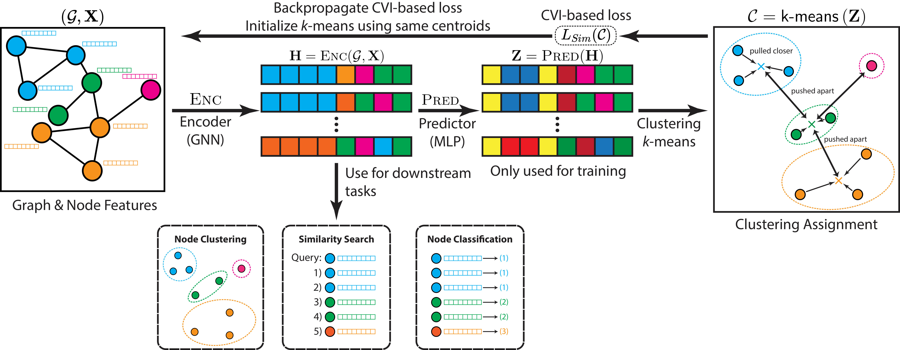

# CARL-G: Clustering-Accelerated Representation Learning on Graphs



## Implementation Details

As described in the paper, we run all of our non-timing experiments on a comination of local and cloud resources - either on a NVIDIA RTX A4000 or V100 GPU (each with 16GB of VRAM). All timing experiments were conducted on Google Cloud Platform with a V100 GPU. We perform 50 runs of Bayesian hyperparameter optimization using Weights and Biases on each CVI/dataset/task for each of the three methods. The best-performing hyperparameters for each CVI and dataset on node classification can be found in the `config` directory.

## Running the Code

The code for CARL-G is in the `src` directory. `train_carlg.py` contains the code for the base CARL-G implementation, which trains and evaluates a model for node classification. `train_carlg_clustering.py` trains and evaluates CARL-G on node clustering and similarity search.

To run the model with the best hyperparameters, you can use the `--flagfile` flag. For example:

```bash
cd src
python train_carlg.py --flagfile=../config/sim_amazon-computers_class.cfg
```

to train and evaluate the model on the `amazon-computers` dataset for node classification tasks.

Many configurations of the models can be modified through the use of flags:

- `--clustering_metric`: This specifies the variant of CARL-G. The three possible values are:
  - `silhouette`: $\text{CARL-G}_{Sil}$ - the silhouette-based variant.
  - `fast_silhouette`: $\text{CARL-G}_{Sim}$- the faster simplified-silhouette-based variant.
  - `vrc`: $\text{CARL-G}_{VRC}$ - the VRC-based variant.
- `--score_target`: The target CVI score ($\tau$ in the paper).
- `--num_clusters`: The number of clusters ($c$ in the paper).
- `--dataset`: Which dataset to run the model on.

There are more configuration options that can be seen by viewing the code or by using the `--helpfull` flag.

We also include the weights for classification tasks in the `weights` directory, which can be directly loaded for evaluation purposes.

## Credit

We used code from [Link Prediction with Non-Contrastive Learning](https://github.com/snap-research/non-contrastive-link-prediction). We also used the evaluation portions of the code from the [reference BGRL implementation](https://github.com/nerdslab/bgrl) and the [reference AFGRL implementation](https://github.com/Namkyeong/AFGRL).

If you use this code, please cite:

```
@article{shiao2023carl,
  title={CARL-G: Clustering-Accelerated Representation Learning on Graphs},
  author={Shiao, William and Saini, Uday Singh and Liu, Yozen and Zhao, Tong and Shah, Neil and Papalexakis, Evangelos E},
  journal={arXiv preprint arXiv:2306.06936},
  year={2023}
}
```
